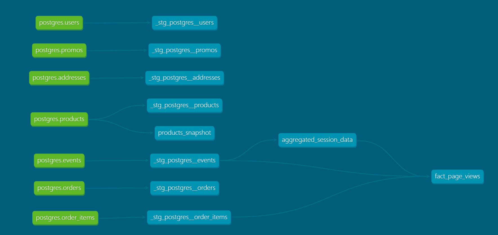

# Week 2 Project

### Part 1. Models
1. What is our user repeat rate?
    > 
    ```sql
    SELECT *
    FROM DEV_DB.DBT_BIODUNIWAYEMICLEARWAYENERGYCOM.XX; 
    ```
    __Answer:__ XX
    

2. What are good indicators of a user who will likely purchase again? What about indicators of users who are likely NOT to purchase again? If you had more data, what features would you want to look into to answer this question?
    > 
 
    __Answer:__
    1. Potentially good indicators of users who will purchase again are users who:
        * Have purchased frequently
        * Tend to checkout most or all the items in their cart
        * Make purchases without purchase regularly without promotional codes
    1. Indicators of users who may not purchase again may be:
        * Sessions without any checkout events: could shorter sessions without checkout events indicate unsatisfied users?
        *

3. What are daily page views by product? Daily orders by product? 
    >  
    
    __Answers:__
    ```sql

    -- Daily page views by product
    select
        product_id,
        DATE_TRUNC(day, session_start_time) as day_of_order,
        SUM(num_page_views_for_product) as total_daily_page_views
    from 
        dbt_bioduniwayemiclearwayenergycom.fact_page_views
    group by 1, 2
    order by day_of_order;

    -- Daily orders by product
    select
        DATE_TRUNC(day, session_start_time) as day_of_order,
        product_id,
        SUM(num_checkout_events_for_product) as total_checkout_events
    from 
        dbt_bioduniwayemiclearwayenergycom.fact_page_views
    group by 1, 2
    order by day_of_order;
    ```

5. Explain the product mart models you added. Why did you organize the models in the way you did?
   >
    
    __Answer:__ 
    > I added an intermediate model called `aggregated_session_data` that aggregates the following metrics for each session:
    > * Session start and end time
    > * Session duration
    > * Counts for all the event types in the session
    > * The final event of the session so we can quickly see if a session ended in a sale 
    
    > I also created a mart model called `fact_page_views`. The combination of these two models allows us to quickly answer questions about our product and they are designed to permit re-use and minimize code repitition. 


6. Use the dbt docs to visualize your model DAGs to ensure the model layers make sense

    

### Part 2. Tests
1. What assumptions are you making about each model? (i.e. why are you adding each test?)

    __Answer:__ 
    1. That the primary keys are unique and not null so I used dbt's `unique` and `not_null` generic tests to validate that in each of my staging models.
    1. That the foreign key relationship between the `order_id` column of my events staging table (___stg_postgres__events__) and the primary key of the ___stg_postgres__orders__ table is valid. I tested that using dbt's `relationship` test. I also added a test to confirm that the values of the `event_type` column fall within this set ('page_view', 'add_to_cart', 'checkout', 'package_shipped'):

    ```yaml

    - name: _stg_postgres__events
        description: Order events
        columns:
        - name: event_id
            tests:
            - unique
            - not_null
        - name: order_id
            tests:
            - relationships:
                to: ref('_stg_postgres__orders')
                field: order_id 
        - name: event_type
            tests:
            - not_null
            - accepted_values:
                values: ['page_view', 'add_to_cart', 'checkout', 'package_shipped']

    ``` 

1. Did you find any “bad” data as you added and ran tests on your models? How did you go about either cleaning the data in the dbt model or adjusting your assumptions/tests? 


    __Answer:__ I found that the primary key of the __order_items__ table isn't unique so I added a test for the uniqueness of the composite key of `order_id` and `product_id`.

    ```yaml
      - name: _stg_postgres__order_items
        description: contents of each order_items
        tests:
        - unique:
            column_name: "(order_id || '-' || product_id )"
        columns:
        - name: order_id
            tests:  
            - not_null
     
     ```

### Part 3. Snapshots
1. Which products had their inventory change from week 1 to week 2?

    >  
    
    ```sql

    with modified_products AS (
        select 
            product_id
        from 
            dbt_bioduniwayemiclearwayenergycom.products_snapshot
        where
            dbt_valid_to IS NOT NULL
    )

    select *
    from
         dbt_bioduniwayemiclearwayenergycom.products_snapshot as snapshot_table
    join 
        modified_products AS mod_prods ON mod_prods.product_id = snapshot_table.product_id
    order by snapshot_table.product_id, snapshot_table.dbt_updated_at;
    
    ```
    
    __Answer:__ 
    The four products below all had a drop in inventory:
    
    | Name | Old inventory level | New inventory level |
    | --- | --- | ---- |
    | Pothos | 40 | 20 |
    | Philodendron| 51 | 25 |
    | Monstera | 77 | 64 |
    | String of pearls | 58  | 10 |
